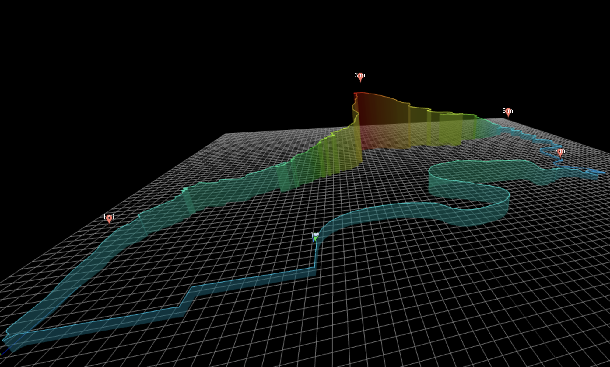

# GPX 3D Plotter

An interactive 3D GPX file visualizer built with React and Three.js. Load a `.gpx` file and explore your GPS track in 3D space, with mile markers, a start pin, and a checkered flag at the finish.

## ✨ Features

- 🗺️ 3D plot of latitude, longitude, and elevation
- 📍 Google-style map markers:
  - ✅ Green pin at start
  - 🏁 Checkered flag at finish
  - 🔴 Red pins every mile
- 📏 Top-down 2D view centered on the route
- 🎮 Interactive 3D controls (rotate, zoom, pan)
- 🧭 Axis helper and auto-scaled grid
- 📁 Drag and drop GPX file upload

## 📸 Preview



---

## 🚀 Getting Started

### 1. Clone the repo

```bash
git clone https://github.com/spaceshiptrip/GPXPlotter
cd GPXPlotter
````

### 2. Install dependencies

```bash
npm install
```

### 3. Run the app

```bash
npm start
```

Visit: [http://localhost:3000](http://localhost:3000)

### 4. Load a GPX file
Click the upload button to select and render a `.gpx` file.


---

## Customizing Fill Opacity
To adjust the transparency of the elevation area fill, edit the following line in `GPX3DPlotter.jsx`:

```js
const fillMaterial = new THREE.LineBasicMaterial({ vertexColors: true, transparent: true, opacity: 0.15 });
```

You can change the `opacity` value (between 0 and 1) to control how visible or soft the filled area appears.

---

## 🐳 Docker Support (optional)

```bash
docker build -t gpx-3d-plotter .
docker run -p 8080:80 gpx-3d-plotter
```

Visit: [http://localhost:8080](http://localhost:8080)

---

## 🛠️ Built With

* [React](https://reactjs.org/)
* [Three.js](https://threejs.org/)
* [gpxparser](https://www.npmjs.com/package/gpxparser)
* [CSS2DRenderer](https://threejs.org/docs/#examples/en/renderers/CSS2DRenderer)
* [OrbitControls](https://threejs.org/docs/#examples/en/controls/OrbitControls)

---

## 📌 Roadmap Ideas

* Toggle between 2D and 3D views
* Export as image or STL
* Support for GPX extensions (heart rate, cadence, etc.)
* Add terrain overlays or map tile base

---

## 📄 License

MIT — free to use and modify

---

Made with ❤️ by spaceshiptrip 🚀

```

Let me know if you want to generate a live demo badge (e.g., Vercel/Netlify), include screenshots, or automate deployment with GitHub Actions!
```

